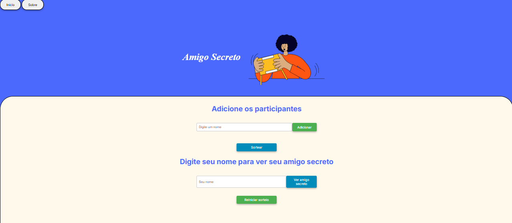

  <h1 align="center">
    Amigo Secreto Alura
    Alura Secret Santa
     
     
    
  </h1>

## Descrição do projeto
## Project Description

  Este projeto foi desenvolvido como parte da conclusão da fase de seleção do programa ONE (Oracle Next Education) em parceria com a Alura.
  This project was developed as part of the conclusion of the selection phase for the ONE (Oracle Next Education) program, in partnership with Alura. 

## Funcionalidades
## Features

1. **Adicionar Participantes:**
   **Add Participants:**
   - Insira o nome de cada participante no campo de texto e clique em "Adicionar".
   - Enter each participant's name in the text field and click "Add."
   - O nome será validado para garantir que não seja repetido.
   - The name will be validated to ensure it's not a duplicate
2. **Lista de Participantes:**
   **Participant List:**
   - Todos os nomes adicionados são exibidos em uma lista abaixo do campo de entrada.
   - All added names are displayed in a list below the input field.
3. **Sortear:**
   **Draw/Sort:**
   - O sorteio somente acontecerá quando houver pelo menos 4 participantes, e a lista contiver números pares de participantes.
   - The draw will only happen when there are at least 4 participants and the list contains an even number of participants.
   - Clique no botão "Sortear" para embaralhar os nomes e gerar os pares do Amigo Secreto, que ficarão ocultos.
   - Click the "Draw" button to shuffle the names and generate the secret Santa pairs, which will remain hidden.
   - Após o sorteio, aparecerá o sinal de interrogação (?) na frente dos nomes e novos nomes não poderão ser acrescentados.
   - After the draw, a question mark (?) will appear in front of the names, and no new names can be added.
4. **Ver Amigo Secreto:**
   **View Secret Santa:**
   - Coloque seu nome no campo e clique no botão "Ver amigo secreto". O nome do seu amigo secreto será exibido com o aviso de que será mostrado apenas uma vez, e depois seu nome ficará bloqueado para novas consultas.
   - Enter your name in the field and click the "View Secret Santa" button. Your secret Santa's name will be displayed with a warning that it will only be shown once, and then your name will be blocked from further inquiries.
5. **Reiniciar Sorteio:**
   **Restart Draw:**
   - Use o botão "Reiniciar sorteio" para limpar a lista de participantes e os resultados, permitindo um novo sorteio.
   - Use the "Restart Draw" button to clear the participant list and results, allowing for a new draw.
 

  <h3 align="center">
    Apresentação
     
     
    
  </h3>

## Uso
## Usage

O jogo de amigo secreto é uma diversão popular em várias ocasiões, como:
The Secret Santa game is a popular pastime for various occasions, such as:

1. **Festas de Natal:** Ideal para as celebrações de fim de ano com trocas de presentes.
  **Christmas Parties:** Ideal for end-of-year celebrations with gift exchanges.
2. **Reuniões de Trabalho:** Ótimo para confraternizações de equipes.
   **Work Gatherings:** Great for team building events.
3. **Reuniões de Família ou Amigos:** Perfeito para eventos especiais e reuniões informais.
   **Family or Friends Gatherings:** Perfect for special events and informal get-togethers.
4. **Eventos Escolares ou Universitários:** Para promover interação entre alunos e colegas de classe.
   **School or University Events:** To promote interaction among students and classmates.

## Desenvolvedor
## Developer

Marcelo da Silva Camilo
